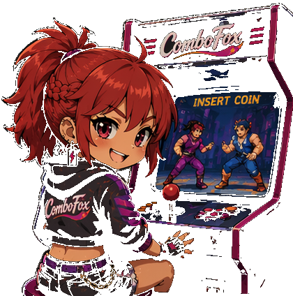
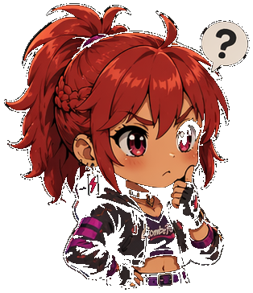

# ComboFox

<p align="center" bgcolor="#000000">
  
</p>

> Arcade knowledge, organized. Move lists, cabinet secrets, and a collection that finally makes sense.

ComboFox is a solo arcade project built from one person’s long-running obsession with Neo Geo, fighting games, collecting, and the kind of historical knowledge that keeps getting buried across FAQs, forum threads, old websites, scanned manuals and random PDFs.

It started as a practical idea: I wanted a cleaner way to look up move lists, check DIP settings, track the games I own, and keep the weird little details of these systems in one place. That is still the heart of the project today.

It is not a company, a large open-source organization, or a mature community-maintained database. It is a fairly ambitious arcade knowledge project being built and curated by one person, with a lot of love for the subject matter and a lot of room to grow. And in fact most of the curation comes from the great arcade communities & websites around, so most of the work comes from them in fact, and the app credits its sources wherever possible.

## What is ComboFox?

ComboFox is a player and collector companion for arcade and retro-gaming enthusiasts. It focuses first on fighting-game systems and arcade hardware families where the knowledge is often fragmented: Neo Geo, Capcom CPS-era titles, and related arcade ecosystems.

The app is meant to make that information more usable. Instead of hunting through scattered references, you can browse catalog data, check move lists, compare settings, and keep track of your own collection in a single place.

The project grew from repeated personal questions: why is this information so scattered, why are the useful details so hard to find, and why is there no cleaner way to organize all of it? That is the core of ComboFox.

## At a glance

<table>
  <tr>
    <td bgcolor="#000000" align="center" valign="middle" width="33%">
      
    </td>
  </tr>
</table>

## What ComboFox does

### Explore arcade games

- Browse games by platform, title, publisher and year
- Keep the catalog focused on the systems that matter to fighting-game and arcade collectors
- Surface game metadata in a cleaner, more searchable format than a pile of fragmented references

### Moves, characters, and notation

- View move lists and character data where they exist
- Present input notation in a structured, readable way
- Move toward structured move data instead of treating legacy command strings as the final format
- Support notation across different control schemes and hardware conventions

### Cabinet knowledge

- Show soft DIP settings and region-specific operator options when the data exists
- Surface debug and hidden settings where supported by the underlying data
- Keep a strong eye on the kind of arcade detail that matters to real cabinet and hardware nerds

### Build your collection

- Track the games and hardware you own
- Record platform-specific collection details and completeness milestones
- Add items from a game page or scan entries in batches
- Keep a personal arcade shelf that is still useful even when you are not actively playing

### Foxxy’s corner of the lab

<table>
  <tr>
    <td bgcolor="#000000" align="center" valign="middle" width="33%">
      
    </td>
  </tr>
</table>

- Treat weird revisions, regional differences and collector details as useful historical data
- Keep an eye on the strange little things that make arcade hardware interesting
- Bring a little personality without making the project feel unserious

## Platforms and coverage

Neo Geo is the historical core of the project, but the app is expanding beyond it as the data model broadens.

| Platform | Coverage |
|---|---|
| Neo Geo MVS / AES / Neo Geo CD | Core focus |
| Capcom CPS-1 | Early support |
| Capcom CPS-2 | Early support |
| Capcom CPS-3 | Soon |
| Neo Geo Pocket / NGPC | Early support |
| Other arcade families | Planned (Taito F3...) |

This is important: supporting a platform is not the same thing as having complete metadata for every game on that platform. Coverage varies significantly between titles, and some games have only a basic catalog entry while others have richer move lists, DIP data, collection metadata and more.

## The data behind the app

There are really two sides to ComboFox:

1. the player and collector-facing app
2. the curated arcade-data project feeding it

The app is the part people use to browse and explore. The data layer is the more interesting part for many arcade fans: a process of turning messy historical sources into structured, organized information.

That includes things like:

- game metadata and platform variants
- release information and region handling
- character records
- move lists and command notation
- soft DIP and debug information
- collector-oriented metadata

Not every game has every category of data, and that is part of the real work here. The project is not pretending to be magically comprehensive. It is building a usable, curated arcade database piece by piece.

A significant part of the project is moving beyond legacy command strings such as command.dat and toward structured move data: motions, buttons, sequences, charges, and other input semantics represented in a normalized form, then rendered appropriately for different games and hardware.

That matters because the app is broadening beyond Neo Geo and into systems whose controls, notation and data conventions can differ in meaningful ways.

## Tech stack

ComboFox is built with a compact stack for a mobile-first app:

- Flutter + Dart
- Firebase for app services and backend data
- Firestore for game and user data
- Firebase Authentication for user-backed collection and favorites
- Cloud Functions where server-side support is needed
- Flutter assets and custom glyph rendering for fighting-game notation

## Running locally

The project is a Flutter app, but it expects Firebase configuration to exist in a local checkout.

### Prerequisites

- [Flutter SDK](https://docs.flutter.dev/get-started/install) (stable channel)
- [Firebase CLI](https://firebase.google.com/docs/cli)
- [FlutterFire CLI](https://firebase.flutter.dev/docs/cli/) (`dart pub global activate flutterfire_cli`)
- [Node.js 20](https://nodejs.org/) for Cloud Functions

### Setup

```bash
git clone https://github.com/kl3mousse/neo-playbook.git
cd neo-playbook
flutter pub get

# If your local environment does not already include the project Firebase config,
# restore or generate it before running the app.
flutterfire configure

# Install Cloud Functions dependencies
cd functions && npm install && cd ..
```

If the Firebase project files are missing, a local run may not work fully until the generated configuration is restored or regenerated.

### Run the app

```bash
# Web
flutter run -d chrome

# iOS / Android (device or emulator)
flutter run
```

### Quick checks

```bash
flutter test
flutter analyze
```

For specialist tooling such as the Glyph Studio workflow, see [docs/glyph-studio.md](docs/glyph-studio.md).

## Project status

ComboFox is actively developed, and the project is still very much in motion.

Some games have only basic catalog information. Others have richer data, such as move lists, characters, DIP settings, collector metadata, or other more detailed notes. Some features and data pipelines are still experimental. The data model is evolving, especially around move lists and multi-platform support.

That is not a bug or a warning label — it is simply an honest description of a project that is being built by one person and is still growing. Bugs, missing data and incomplete systems should be expected, and that is part of the project’s current reality.

## Contributing

ComboFox is currently a solo project, but corrections and arcade knowledge are very welcome.

If you spot missing or incorrect metadata, wrong move data, a weird regional difference, an undocumented setting, or something gloriously obscure in an operator menu, open an issue. If you know something useful about a title, revision, cabinet quirk, or collector detail, that kind of knowledge is exactly what makes the project better.

Code contributions are welcome too, but the project is not yet organized around a mature contributor workflow or a large open-source community. For now, the best route is usually to open an issue, share the correction, and work from there.

## Disclaimer

ComboFox and the Foxxy project artwork are original project assets created for this repository. Game names, screenshots, hardware photos, trademarks and other intellectual property remain the property of their respective owners.

This project is an independent fan project and is not affiliated with, endorsed by, or sponsored by the companies behind the games or hardware it references.

## License

This project is licensed under the [MIT License](LICENSE).

---

If you love obscure arcade details, weird regional revisions, and fighting-game data that feels genuinely lived-in, ComboFox is probably for you.

If you want to follow the project and help it get better, star the repository, report bad data, or share a detail you know that would be useful to the archive.
